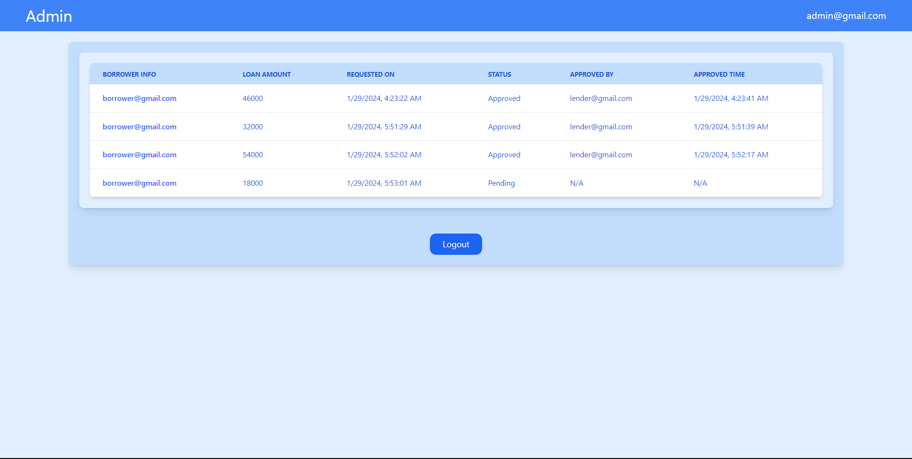

# Loan Management

A Meteor application designed for streamlined loan requests, featuring an administrative panel for enhanced management and live updates.

## Demo

## Setup

This project necessitates the installation of Meteor, ReactJS (version 16 or higher), and NodeJS (version 14 or higher), all of which are straightforward to set up. To verify their availability on your system, execute the following command. Consider using Volta for a hassle-free downgrade of NodeJS.
